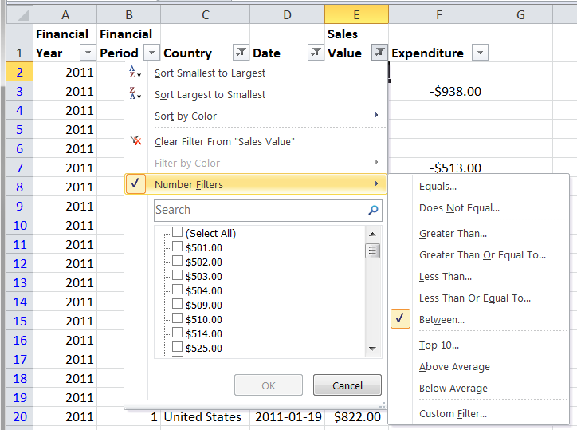

# PHPExcel AutoFilter Reference 


## Autofilter Expressions

### Custom filters

In MS Excel, Custom filters allow us to select more complex conditions using an operator as well as a value. Typical examples might be values that fall within a range (e.g. between -20 and +20), or text values with wildcards (e.g. beginning with the letter U). To handle this, they




Custom filters are limited to 2 rules, and these can be joined using either an AND or an OR.

We start by specifying a Filter type, this time a CUSTOMFILTER.

```php
use app\PHPExcel$columnFilter->setFilterType(
    PHPExcel_Worksheet_AutoFilter_Column::AUTOFILTER_FILTERTYPE_CUSTOMFILTER
);
```

And then define our rules.

The following shows a simple wildcard filter to show all column entries beginning with the letter 'U'.

```php
use app\PHPExceluse app\PHPExcel$columnFilter->createRule()
    ->setRule(
        PHPExcel_Worksheet_AutoFilter_Column_Rule::AUTOFILTER_COLUMN_RULE_EQUAL,
        'U*'
    )
    ->setRuleType(
        PHPExcel_Worksheet_AutoFilter_Column_Rule::AUTOFILTER_RULETYPE_CUSTOMFILTER
    );
```

MS Excel uses \* as a wildcard to match any number of characters, and ? as a wildcard to match a single character. 'U\*' equates to "begins with a 'U'"; '\*U' equates to "ends with a 'U'"; and '\*U\*' equates to "contains a 'U'"

If you want to match explicitly against a \* or a ? character, you can escape it with a tilde (~), so ?~\*\* would explicitly match for a \* character as the second character in the cell value, followed by any number of other characters. The only other character that needs escaping is the ~ itself.

To create a "between" condition, we need to define two rules:

```php
use app\PHPExceluse app\PHPExceluse app\PHPExceluse app\PHPExcel$columnFilter->createRule()
    ->setRule(
        PHPExcel_Worksheet_AutoFilter_Column_Rule::AUTOFILTER_COLUMN_RULE_GREATERTHANOREQUAL,
        -20
    )
    ->setRuleType(
        PHPExcel_Worksheet_AutoFilter_Column_Rule::AUTOFILTER_RULETYPE_CUSTOMFILTER
    );
$columnFilter->createRule()
    ->setRule(
        PHPExcel_Worksheet_AutoFilter_Column_Rule::AUTOFILTER_COLUMN_RULE_LESSTHANOREQUAL,
        20
    )
    ->setRuleType(
        PHPExcel_Worksheet_AutoFilter_Column_Rule::AUTOFILTER_RULETYPE_CUSTOMFILTER
    );
```

We also set the rule type to CUSTOMFILTER.

This defined two rules, filtering numbers that are >= -20 OR <= 20, so we also need to modify the join condition to reflect AND rather than OR.

```php
use app\PHPExcel$columnFilter->setAndOr(
    PHPExcel_Worksheet_AutoFilter_Column::AUTOFILTER_COLUMN_ANDOR_AND
);
```

The valid set of operators for Custom Filters are defined in the PHPExcel_Worksheet_AutoFilter_Column_Rule class, and comprise:

    Operator Constant                         | Value                |
    ------------------------------------------|----------------------|
    AUTOFILTER_COLUMN_RULE_EQUAL              | 'equal'              |
    AUTOFILTER_COLUMN_RULE_NOTEQUAL           | 'notEqual'           |
    AUTOFILTER_COLUMN_RULE_GREATERTHAN        | 'greaterThan'        |
    AUTOFILTER_COLUMN_RULE_GREATERTHANOREQUAL | 'greaterThanOrEqual' |
    AUTOFILTER_COLUMN_RULE_LESSTHAN           | 'lessThan'           |
    AUTOFILTER_COLUMN_RULE_LESSTHANOREQUAL    | 'lessThanOrEqual'    |

